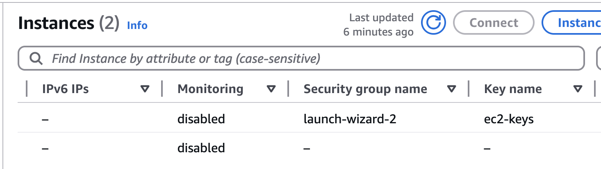
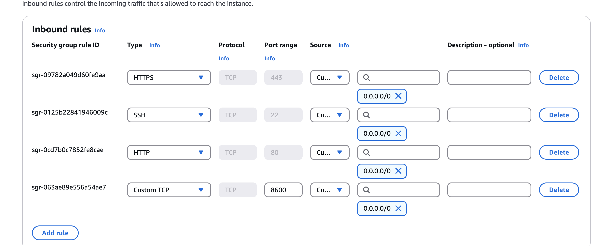

# Introduction to AWS

Today, we will focus on the use of some simple AWS services. We will use the AWS Management Console to create and manage these services. We will also use the AWS CLI to interact with these services.

## Launch an EC2 Instance

1. Go to the AWS Management Console and navigate to the EC2 service.

2. Click on the "Launch Instance" button.

3. Write the name of the instance in the "Instance Name" field (e.g., "ejemplo-1").

4. Select "Ubuntu Server 20.04 LTS (HVM), SSD Volume Type" as the Amazon Machine Image (AMI).

5. Select the "t3.micro" instance type.

6. Generate a new key pair and download it. Give it a name (e.g., `ec2-2keys`).

7. Allow ssh, https and http traffic in the security group.


## Login to the EC2 Instance

1. Try to login to the EC2 instance using the command that you can find in the EC2 console.

2. For Mac users, an error will appear because the key pair has a permission that is too open. Change the permission of the key pair using the following command:

```bash
chmod 400 ec2-2keys.pem
```

3. Try to login to the EC2 instance again using the command that you can find in the EC2 console.

4. Install docker by running the following commands:

```bash
sudo snap install docker
sudo usermod -aG docker $USER
```

5. Logout and login again to apply the changes.
6. Run the following command to check if docker is installed correctly:

```bash
docker --version
```

## Install image with SuperMario

1. Run the following command to pull the image with SuperMario:

```bash
docker run -d -p 8600:8080 pengbai/docker-supermario
```

2. Get the IP of the EC2 instance by running the following command:

```bash
curl ifconfig.me
```

3. Open a browser and go to the following URL:

```
http://<IP>:8600
```

4. You will see that you can't connect to the server. This is because the security group is not allowing traffic on port 8600.

5. We need to add a new rule in the security group to allow traffic on port 8600. To do so go to the EC2 instance and check its security group.

<br>

<br>


6. After that, open the security group and modify the inbound rules to allow traffic on port 8600.

<br>

<br>


7. Click add rule and select the following options:

- Type: Custom TCP
- Protocol: TCP
- Port Range: 8600
- Source: Anywhere IPv4
  
  Once everything is configured, you should see the following:

<br>



8. Now, try to access the SuperMario game again by going to the following URL. You should see the game running.

   
## Installation of AWS CLI

To install the AWS CLI, you can follow the instructions provided in the [official documentation](https://docs.aws.amazon.com/cli/latest/userguide/install-cliv2.html).


