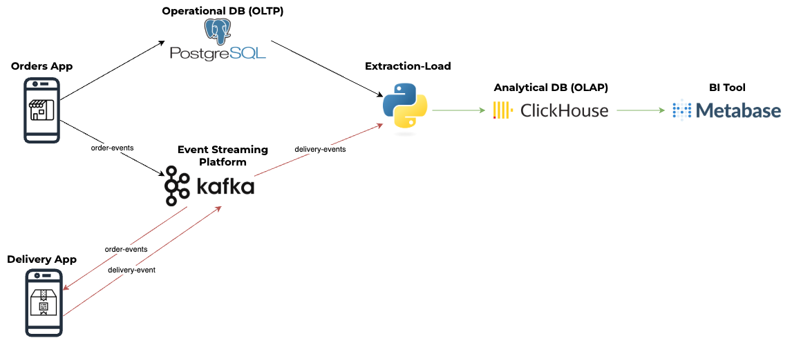
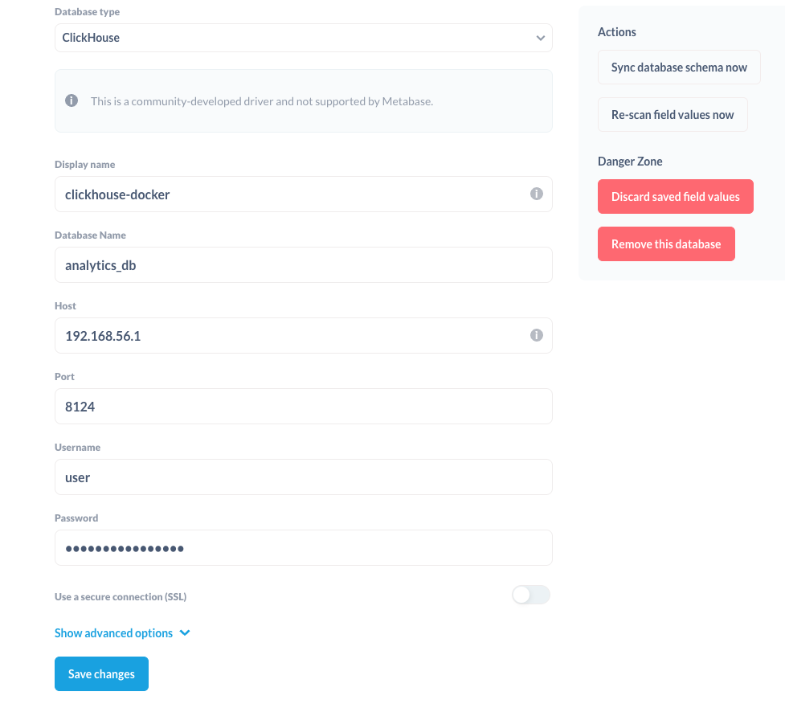
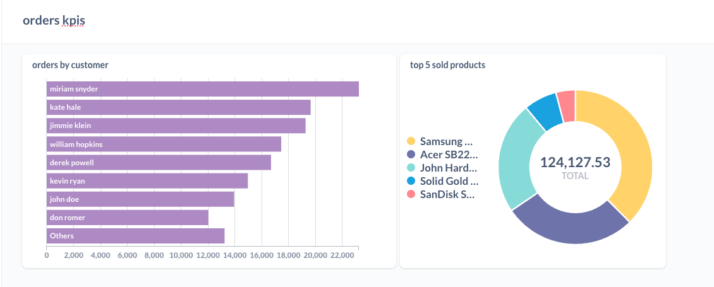

# END2END Cloud Introduction Excercise

This end2end is inspired in a simplified architecture that you can find in an ecommerce platform

## Architecture

The following image shows the architecture of this excercise

<p align="center">

</p>

There are different components:
- **Orders App**: It includes a Postgres DB (OLTP) and a connection to a public API suggested by ChatGPT ([fakestoreapi](https://fakestoreapi.com)) to simulate simple transactions of an eccomerce. It includes the following entities in the data model: customers, orders, products, order_products. A publisher is imported to send the confirmations of orders to the Delivery App. The transactions on the database are ACID compliant
  
- **Delivery App**: It includes a Subscriber and Publisher to Kafka. The subscriber consumes the messages from `order-events` to confirm when a new order is placed. Then a sequence of messages are generated to simulated the delivery process of those orders. These messages are sent to the topic `delivery-events`

- **Extraction-Load (EL)**: This is included within the analytical_layer directory. There are two types of EL, one (el_orders) for making a replica of the Operational DB (Postgres) with the orders to the Analytical DB (ClickHouse), which is OLAP compliant, and the other (el_delivery) to append the new events of the orders that are/have been delivered to the same DB

- **Metabase**: Metabase is a BI tool used to make dashboards with different cards that can show different KPIs of a company.

## Orders App

Within the orders app there are three directories:

- [**chatgpt_orders**](./orders_app/chatgpt_orders/): A script mainly generated by ChatGPT with some small modifications, that connects to an API and simulates the generation of customers, products and orders in an ecommerce. The script has been left as similar as possible to how ChatGPT made it to show its capabilities
  
- [**events_utils**](./orders_app/events_utils/): This is a module that includes the logic to handle the publication of messages to Kafka. It is similar to the other utils of the other applications in purpose to show the modularity of using microservices.

- [**orders_to_db**](./orders_app/orders_to_db/): It includes the main script, which imports as a module both the events_utils and the chatgpt_orders functions and classes. It contains all the logic to generate orders for a certain number of customers that can buy a limited number of products. The transactions are kept following [ACID](https://en.wikipedia.org/wiki/ACID) (Atomicity, Consistency, Isolation and Durability) properties.

### To run orders_app

Launch the docker-compose
```sh
docker-compose up -d
```
Run the following command inside orders_app in a VM or your local computer
```sh
HOST_IP=localhost KAFKA_IP=<delivery-app-host> python -m orders_to_db.main
```

In case you don't want the program to stop even if you close the terminal, you can run inside the delivery_app folder:
```sh
nohup bash -c 'HOST_IP=localhost KAFKA_IP=<delivery-app-host> python -m orders_to_db.main' > output.log 2>&1 &
```

To follow the logs run:
```sh
tail -f output.log
```

To stop the program, you can run:
```sh
pkill python
```

## Delivery App

Within the orders app there are three directories:

- [**delivery_events**](./delivery_app/delivery_events/): It has a main script that handles both the pulling of messaging from the orders-event topic, and the pushing of the delivery events to the delivery-events topic
  
- [**utils**]: Similar to the utils of orders app, it is used to package the required code for publishing and reading messages from Kafka


### To run delivery_app

There is a Makefile included to show how Makefile work, symplifying the launching of commands. 

Launch the docker-compose in Mac
```sh
 make launch-events-brokers-mac
```

Launch the docker-compose in Ubuntu server
```sh
make launch-events-brokers-ubuntu
```

In any other machine, you can run, but you have to set up manually the ip of the Machine inside the Makefile file
```sh
make launch-events-brokers-manual-ip
```

Run the following command inside delivery_app in a VM or your local computer
```sh
KAFKA_IP=<delivery-app-host> python -m delivery_events.main 
```

In case you don't want the program to stop even if you close the terminal, you can run inside the delivery_app folder:
```sh
nohup bash -c 'KAFKA_IP=<delivery-app-host> python -m delivery_events.main' > output.log 2>&1 &
```

To follow the logs run:
```sh
tail -f output.log
```

To stop the program, you can run:
```sh
pkill python
```


## Analytical Layer
The analytical layer has several parts:

- **Docker Compose**: With both the OLAP DB (Clickhouse) and the BI Tool (Metabase)
  
- [**analytical_utils**](./analytical_layer/analytical_utils/): Similar to the utils of the other apps, it is used to package the necessary operations to syncronize events from Kafka and Postgres to Clickhouse

- [**el_delivery**](./analytical_layer/el_delivery/): It contains the script that appends the new events to the delivery_events table within the Data Warehouse (Clickhouse)

- [**el_orders**](./analytical_layer/el_orders/): It contains the script that creates a replica of the tables of the Operational DB into the Data Warehouse

- [**plugins**](./analytical_layer/plugins/): It is a directory that serves as a bind mount volume where the clickhouse plugin required by Metabase has to be dowloaded. After the docker-compose is started, the rest of the plugins created by default by the Metabase Docker image will be included in that folder

### How to run the analytical layer

To dowload the clickhouse plugin for metabase run the following

```sh
curl -L -o ./analytical_layer/plugins/clickhouse.metabase-driver.jar https://github.com/ClickHouse/metabase-clickhouse-driver/releases/download/0.9.0/clickhouse.metabase-driver.jar
```

Launch the docker-compose
```sh
docker-compose up -d
```

Wait for a few minutes until the Metabase container is up and running

To login in the analytical db
```sh
docker exec -it olap_db clickhouse-client
```

To show existing tables after inside the container

```sh
SHOW TABLES FROM analytics_db
```

Run the following command to syncronize the orders table manually within the analytical_layer directory
```sh
HOST_IP=localhost POSTGRES_IP=<orders-app-ip>  python -m el_orders.main
```

If you are using Windows CMD, you can run:

```sh
set HOST_IP=localhost
set POSTGRES_IP=<orders-app-ip>
python -m el_orders.main
```


If you are using Windows Powershell, you can run:

```sh
$env:HOST_IP = "localhost"
$env:POSTGRES_IP = <orders-app-ip>
python -m el_orders.main
```

Run the following command to syncronize the delivery table manually within the analytical_layer directory
```sh
HOST_IP=localhost KAFKA_IP=<delivery-app-host> python -m el_delivery.main
```

If you are using Windows CMD, you can run:
```sh
set HOST_IP="localhost"
set KAFKA_IP="<delivery-app-host>"
python -m el_delivery.main
```

If you are using Windows Powershell, you can run:
```sh
$env:HOST_IP = "localhost"
$env:KAFKA_IP = "<delivery-app-host>"
python -m el_delivery.main
```


To use the docker image that will trigger a cron expression you have to follow this steps:

- Build the image from the root directory (end2end)
```sh
docker build -t analytical-layer-cron -f analytical_layer/docker/Dockerfile .
```

- Run the following command to get the Local Gateway of analytic_layer docker network
```sh
docker inspect olap_db
```

- Run the image passing the enviroment variables for the three machines (KAFKA, POSTGRES and HOST (your machine))
```sh
docker run --network analytical_layer_default -e KAFKA_IP=<delivery-app-ip> -e POSTGRES_IP=<orders-app-ip> -e HOST_IP=<click-house-container-ip> analytical-layer-cron
```


### Metabase

To configure the Clickhouse database in Metabase, the next steps should be followed:

1. Set up the connections settings as seen in the following image
    <p align="center">
    
    </p>

2. Create a new question with the orders per customer
   ```sql
    SELECT
    SUM(total_price) AS total_price,
    c.customer_name
    FROM
    orders o
    LEFT JOIN
    customers c
    ON
    c.id = o.customer_id
    GROUP BY
    customer_name
    ORDER BY
    total_price desc
    ```
3. On the bottom left corner click visualization and choose the horizontal bars type
4. Click save and also add it to a dashboard
5. Create another question with the sql editor and paste this query
   ```sql
    SELECT
    SUM(op.price*op.quantity) AS total_product_spent,
    product_name
    FROM
    orders o
    LEFT JOIN
    order_products op
    ON
    o.id = op.order_id
    LEFT JOIN
    products p
    ON
    op.product_id = p.id
    GROUP BY
    product_name
    ORDER BY
    SUM(op.price*op.quantity) DESC
    LIMIT
    5
    ```
6. Select the pie chart as visualization option
7. Click save and add it to the same dashboard
8. If everything went right, you should see a dashboard like the following
    <p align="center">
    
    </p>


